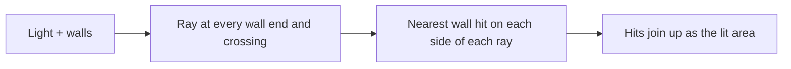
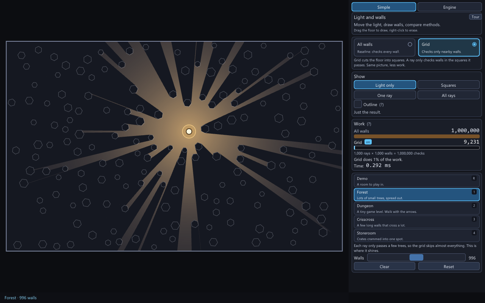
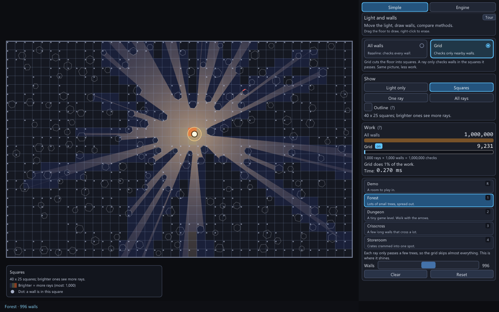
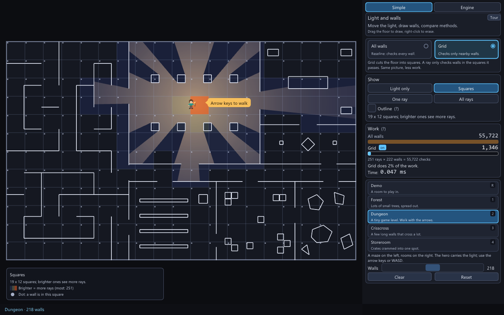
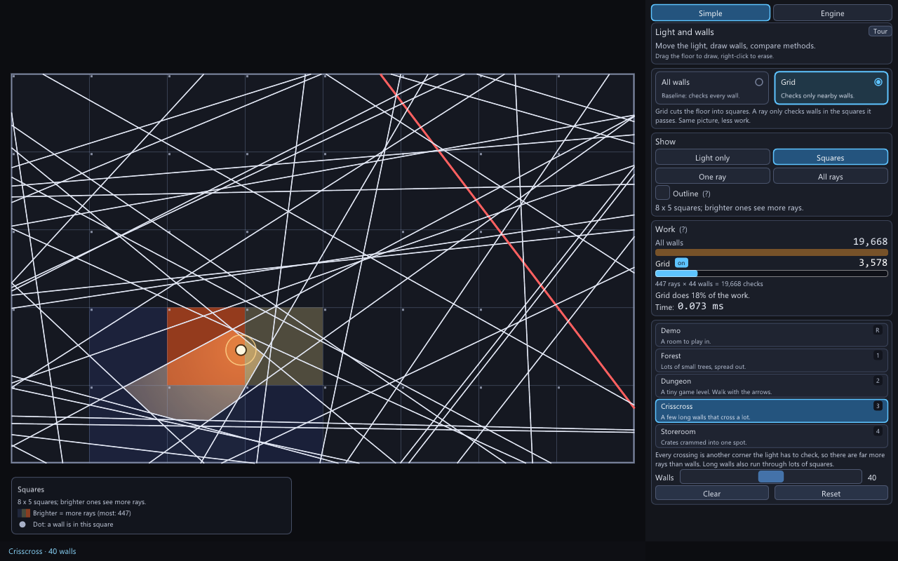
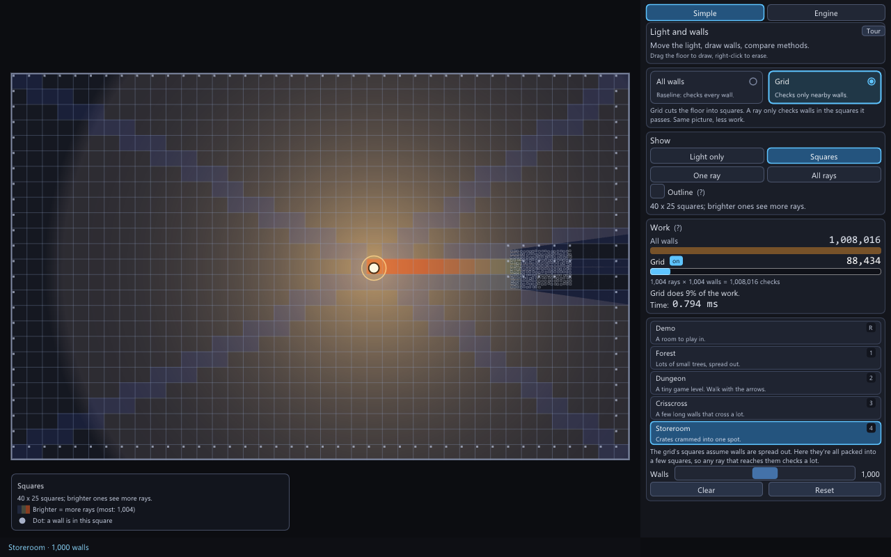

# 2D Visibility and Lighting Engine

Exact hard shadows for a point light among line-segment walls. C++20, with an interactive demo.


- **Exact** No angle nudging or epsilon tricks. Every side-of-line test uses exact arithmetic.
- **Two methods but one result** A simple one and a faster one give bit-identical output.
- **Easy to use** Drag the light, draw walls, and watch how much work each method has to do.
- **Tested** 58 test cases with about 350 assertions.

## How it works


```mermaid
flowchart LR
    A[Light + walls] --> B[Ray at every wall end and crossing]
    B --> C[Nearest wall hit on each side of each ray]
    C --> D[Hits join up as the lit area]
```

The question is: *which wall does each ray hit first?* The two methods have different answers:

| All walls (baseline) | Grid |
|---|---|
| Every ray tests every wall. | Each ray tests only walls in the squares it crosses. |
|  |  |
| Orange = walls tested | Orange = tested, grey = skipped |

## Demo

Two levels, switched at the top of the panel: **Simple** (plain words) and **Engine** (exact numbers).

| Simple | Engine |
|---|---|
|  |  |

| Panel | Does |
|---|---|
| **Method** | Pick *All walls* or *Grid*. |
| **Show** | *Light only*, *Squares* (rays per grid square), *One ray* (follow the ray under the cursor), *All rays*. |
| **Work** | Counts wall tests per method. Same picture, less work. |
| **Scenes** | *Demo*, *Forest*, *Dungeon*, *Crisscross*, *Storeroom*. Each one says what it is and what to look for. |
| **Tour** | Six step tour of the app that opens on first launch. |

| Input | Action |
|---|---|
| Drag the light | Move it |
| Drag the floor | Draw a wall (hold `Shift` to snap to wall ends) |
| Right-click a wall | Erase it |
| `Tab` | Switch method |
| `O` | Cycle *Show* |
| `1` `2` `3` `4` | Load a scene |
| Arrow keys / `WASD` | Walk the light around (it's the hero's torch in the Dungeon) |
| `R` / `C` | Reset / clear walls |

### Scenes

| Forest | Dungeon | Crisscross | Storeroom |
|---|---|---|---|
|  |  |  |  |
| Small trees spread out. The grid shines here | A tiny game level. You walk a little hero with a torch | A few long walls that cross a lot, so there are way more rays than walls | Crates crammed into one spot, so the grid saves much less |

All the screenshots are real captures (`tests/scripts/captures.script`). The benchmark still uses its own four synthetic layouts, see [BENCHMARK.md](docs/BENCHMARK.md).

More detail: [demo guide](docs/APP.md).

## How to run it locally

Windows, Visual Studio Build Tools 2022:

```powershell
.\scripts\dev.ps1 cmake --preset release
.\scripts\dev.ps1 cmake --build --preset release
.\build\release\app\vis_app.exe
```

Tests, benchmarks and platform notes: [docs/RUNNING.md](docs/RUNNING.md).

## Limits

- One point of light, hard shadows (was NOT tryna do a fancy gradient T_T), zero-thickness walls because I'm lazy.
- Every edit rebuilds the grid. Also, very crossing-heavy scenes are slow in both methods.
- Single-threaded. Built and run on Windows with MSVC only so keep that in mind regarding performance metrics.

## Docs

| | |
|---|---|
| [Demo guide](docs/APP.md) | All panels, the work meter, and the tour |
| [Running](docs/RUNNING.md) | Build, test, run, benchmark, flags, scripts |
| [Architecture](docs/ARCHITECTURE.md) | Algorithms and code layout |
| [Walkthrough](docs/WALKTHROUGH.md) | Step by step walkthrough |
| [Design contract](docs/DESIGN.md) | Exact geometry rules |
| [Decisions](docs/DECISIONS.md) | Why I built it this way |
| [Benchmark](docs/BENCHMARK.md) | Measured results for my resume :) |
